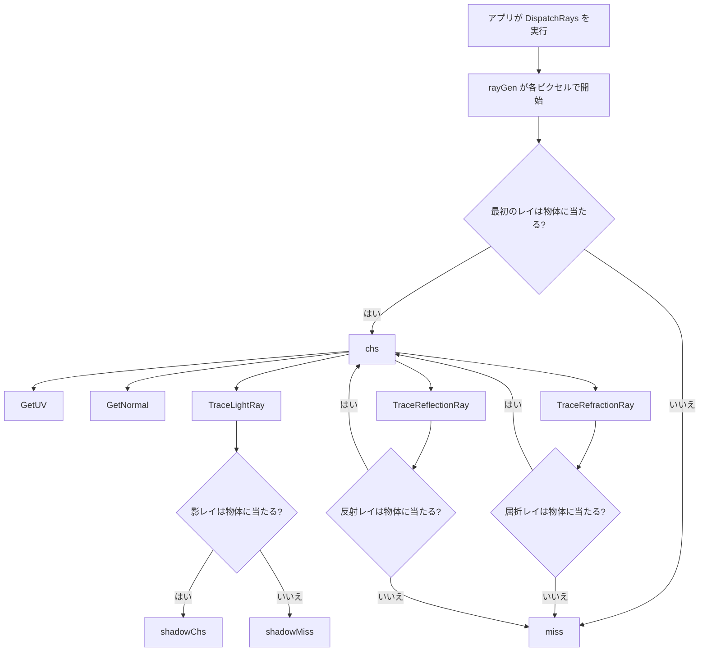
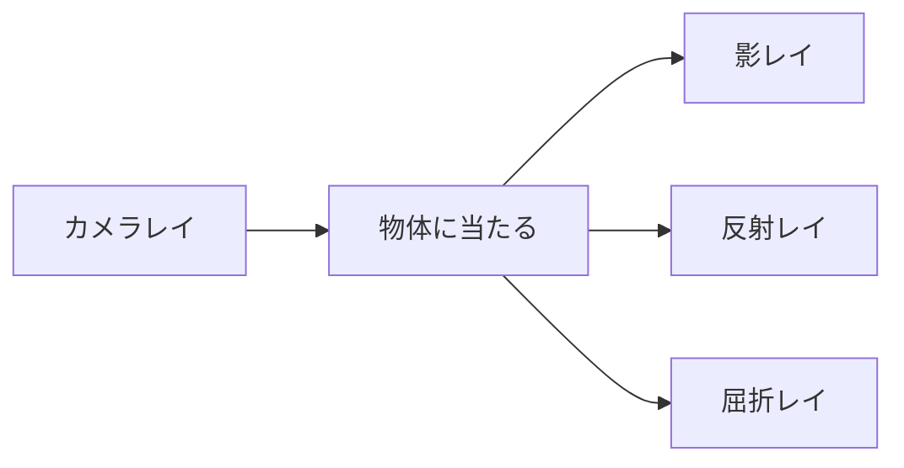
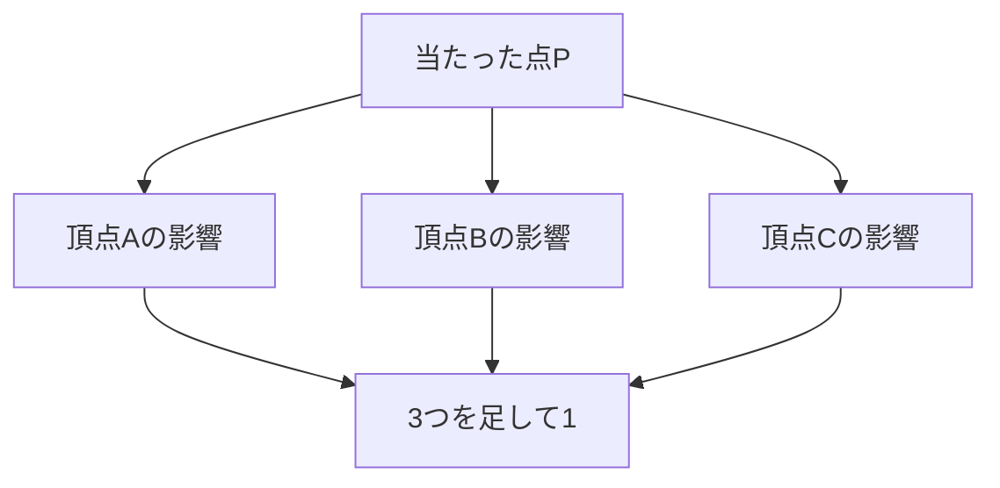
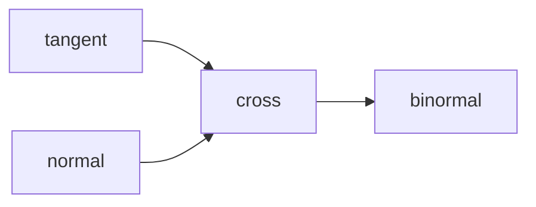
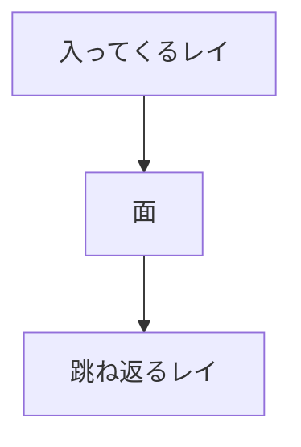
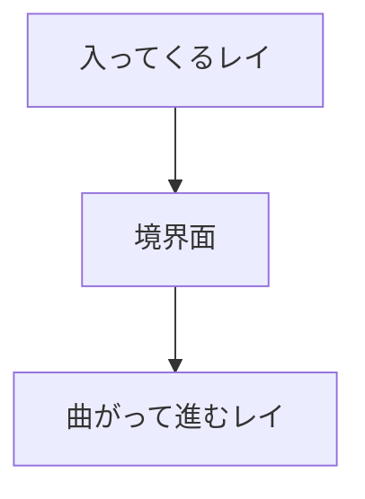
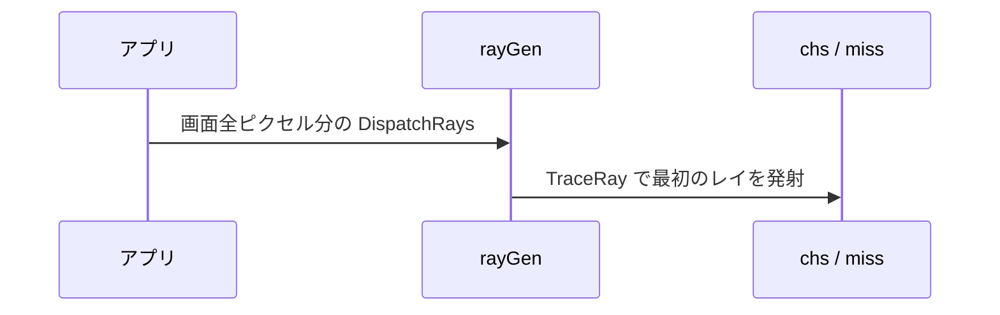
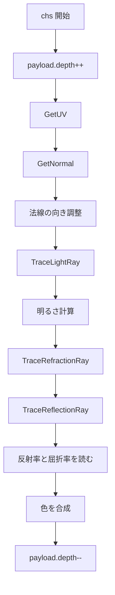
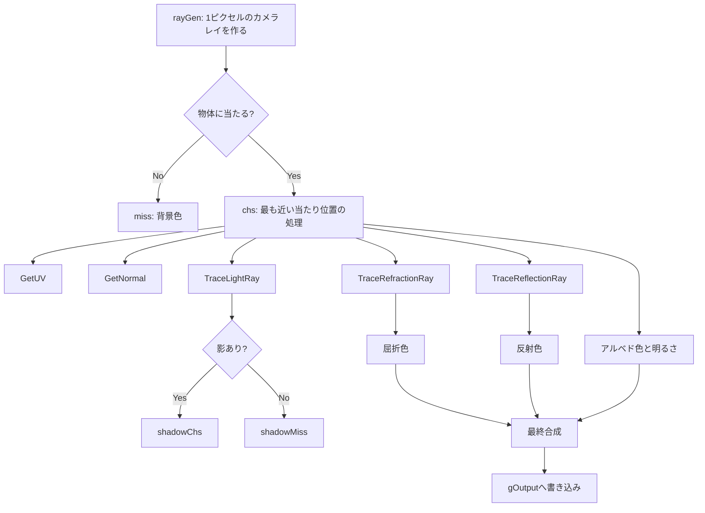

# sample.fx 行番号つき逐次解説

この文書は、`sample.fx` を **上から順番に、行番号ベースで追いかける解説** です。

対象読者は次のような人です。

- HLSLが初めて
- DirectX Raytracingが初めて
- ベクトルや反射・屈折もまだ不安

難しいところは、**まずイメージで理解する** ことを優先しています。

---

## 0. まず最初に: このシェーダー全体は何をしているか

この `sample.fx` は、レイトレーシングで次の流れを行います。

1. カメラから画面の1ピクセルごとにレイを飛ばす
2. 物体に当たったら、その場所の色・法線・影を調べる
3. 必要なら反射レイと屈折レイも飛ばす
4. それらを混ぜて最終色を決める
5. 画像に書き込む

---

## 1. 関数が呼ばれるタイミングの全体像

最初に、**どの関数が、いつ呼ばれるか** をつかむと読みやすくなります。



### ポイント

- `rayGen()` は **画面の各ピクセルごとに最初に呼ばれる**
- `miss()` は **レイが何にも当たらないとき** に呼ばれる
- `chs()` は **いちばん近くに当たった物体** に対して呼ばれる
- `shadowChs()` / `shadowMiss()` は **影確認用のレイ** に対して呼ばれる
- `GetUV()` や `GetNormal()` は、GPUが自動で呼ぶのではなく、**`chs()` の中から手動で呼ばれる普通の関数**

---

## 2. レイの種類

このシェーダーでは、レイが3種類あります。



- **カメラレイ**: 画面を描くための最初のレイ
- **影レイ**: 光が届くか確認するレイ
- **反射レイ**: 鏡のような跳ね返りを見るレイ
- **屈折レイ**: ガラスや水のように通り抜ける方向を見るレイ

---

## 3. 行番号順の逐次解説

以下では `sample.fx` を上から順に見ていきます。

---

## 3.1 1-27行: ライセンス表記

**1-27行** はライセンスです。

ここは描画計算そのものではありません。
コードの利用条件が書かれています。

---

## 3.2 29-40行: `SVertex` 頂点構造体

```hlsl
31: struct SVertex
32: {
33:     float3 pos;
34:     float3 normal;
35:     float3 tangent;
36:     float3 binormal;
37:     float2 uv;
38:     int4 indices;
39:     float4 skinweigths;
40: };
```

### 何を表しているか

1頂点ぶんの情報です。

- `pos` : 頂点の位置
- `normal` : 面の向き
- `tangent` : 表面の横向き
- `binormal` : 表面の縦向き
- `uv` : テクスチャ上の位置

### なぜ必要か

レイが三角形に当たったとき、
その三角形を作っている頂点の情報を使って、

- 色
- 法線
- 凹凸感

を求めるためです。

### 初心者向けメモ

`float3` は「小数3つのセット」です。
座標や向きを表すことが多いです。

たとえば `float3(1, 2, 3)` は、

- x = 1
- y = 2
- z = 3

という3Dの値です。

---

## 3.3 42-51行: `Camera` 構造体

```hlsl
44: struct Camera
45: {
46:     float4x4 mCameraRot;
47:     float3 pos;
48:     float aspect;
49:     float far;
50:     float near;
51: };
```

### 何を表しているか

カメラの設定です。

- `mCameraRot` : カメラの向き
- `pos` : カメラの位置
- `aspect` : 画面の横長・縦長の比
- `far` / `near` : 見える距離の範囲

### 数学のやさしい説明

#### 行列 `float4x4`

`float4x4` は 4×4 の表です。
ゲームではこれを使って

- 回転
- 移動
- 拡大縮小

を計算します。

このファイルでは主に **向きを回す** のに使っています。

---

## 3.4 53-56行: `cbuffer rayGenCB`

```hlsl
53: cbuffer rayGenCB :register(b0)
54: {
55:     Camera g_camera;
56: };
```

### 何をしているか

GPUへ渡す「変わりにくい値の入れ物」です。
ここではカメラ情報を入れています。

### HLSL特有の書き方

- `cbuffer` : 定数バッファ
- `register(b0)` : `b0` 番に置く

これは、アプリ側がGPUへ渡すデータの置き場所を決めています。

---

## 3.5 58-69行: リソース宣言

```hlsl
58: RaytracingAccelerationStructure g_raytracingWorld : register(t0);
59: Texture2D<float4> gAlbedoTexture : register(t1);
60: Texture2D<float4> g_normalMap : register(t2);
61: Texture2D<float4> g_specularMap : register(t3);
62: Texture2D<float4> g_reflectionMap : register(t4);
63: Texture2D<float4> g_refractionMap : register(t5);
64: StructuredBuffer<SVertex> g_vertexBuffers : register(t6);
65: StructuredBuffer<int> g_indexBuffers : register(t7);
67: RWTexture2D<float4> gOutput : register(u0);
69: SamplerState  s : register(s0);
```

### それぞれの役割

- `g_raytracingWorld` : レイを当てる相手の世界
- `gAlbedoTexture` : 基本の色
- `g_normalMap` : 凹凸っぽさを出す法線マップ
- `g_specularMap` : 鏡っぽさに関係しそうなマップ
- `g_reflectionMap` : 反射の強さ
- `g_refractionMap` : 屈折関係の値
- `g_vertexBuffers` : 頂点データ
- `g_indexBuffers` : 三角形を作る番号
- `gOutput` : 出力画像
- `s` : テクスチャの読み取り設定

### HLSL特有の意味

- `t0` などの `t` は、読む系のリソース
- `u0` の `u` は、書き込む系のリソース
- `s0` の `s` はサンプラー

---

## 3.6 71-76行: `RayPayload`

```hlsl
71: struct RayPayload
72: {
73:     float3 color;
74:     int hit;
75:     int depth;
76: };
```

### 何をしているか

レイと一緒に運ぶ荷物です。

- `color` : レイが持ち帰る色
- `hit` : 何かに当たったか
- `depth` : 何回跳ね返ったか

### 呼ばれるタイミングとの関係

`RayPayload` は、`TraceRay()` でレイを飛ばすたびに使われます。

- カメラレイ
- 影レイ
- 反射レイ
- 屈折レイ

の全部で使われます。

### `depth` が必要な理由

反射したレイがまた反射して、さらにまた反射して……
と続くと、終わらなくなることがあります。

なので

- `depth < 3`

のような制限で止めています。

---

## 3.7 78-96行: `GetUV()`

```hlsl
79: float2 GetUV(BuiltInTriangleIntersectionAttributes attribs)
```

### いつ呼ばれるか

この関数は **`chs()` の中で、当たり位置のUVが必要になったとき** に呼ばれます。
GPUが自動で呼ぶ関数ではありません。

### 何をしているか

レイが三角形のどこに当たったかを使って、
その位置のUV座標を計算します。

### 80-82行: バリセントリック座標を作る

```hlsl
81: float3 barycentrics = float3(
        1.0 - attribs.barycentrics.x - attribs.barycentrics.y,
        attribs.barycentrics.x,
        attribs.barycentrics.y);
```

#### 中学生向け説明

三角形の中の1点を、

- 頂点Aを何割
- 頂点Bを何割
- 頂点Cを何割

で表す方法です。

3つを足すと 1 になります。



### 83-92行: 三角形の3頂点を取り出す

```hlsl
84: uint primID = PrimitiveIndex();
87: uint v0_id = g_indexBuffers[primID * 3];
88: uint v1_id = g_indexBuffers[primID * 3 + 1];
89: uint v2_id = g_indexBuffers[primID * 3 + 2];
```

#### HLSL特有の関数 `PrimitiveIndex()`

今レイが当たっている三角形の番号を返します。

1つの三角形は頂点3個でできているので、

- `primID * 3`
- `primID * 3 + 1`
- `primID * 3 + 2`

で3つの頂点番号を取っています。

### 94-95行: UVを補間する

```hlsl
94: float2 uv = barycentrics.x * uv0 + barycentrics.y * uv1 + barycentrics.z * uv2;
95: return uv;
```

#### 数学のやさしい説明: 補間

これは **重み付き平均** です。

たとえば、

- Aを20%
- Bを30%
- Cを50%

の割合で混ぜるイメージです。

---

## 3.8 98-131行: `GetNormal()`

```hlsl
99: float3 GetNormal(BuiltInTriangleIntersectionAttributes attribs, float2 uv)
```

### いつ呼ばれるか

**`chs()` の中で、当たった場所の向きが必要になったとき** に呼ばれます。

### 何をしているか

この関数は、当たった位置の法線を求めます。
しかも、ただの頂点法線ではなく、**法線マップの凹凸も含めた法線** を作ります。

### 111-115行: 頂点法線を補間

```hlsl
111: float3 normal0 = g_vertexBuffers[v0_id].normal;
112: float3 normal1 = g_vertexBuffers[v1_id].normal;
113: float3 normal2 = g_vertexBuffers[v2_id].normal;
114: float3 normal = barycentrics.x * normal0 + barycentrics.y * normal1 + barycentrics.z * normal2;
115: normal = normalize(normal);
```

#### `normalize()` の意味

ベクトルの長さを1にそろえます。

向きだけをきれいに扱いたいので使います。

### 117-123行: tangent と binormal を作る

```hlsl
117: float3 tangent0 = g_vertexBuffers[v0_id].tangent;
120: float3 tangent = barycentrics.x * tangent0 + barycentrics.y * tangent1 + barycentrics.z * tangent2;
121: tangent = normalize(tangent);
123: float3 binormal = normalize(cross(tangent, normal));
```

#### `cross()` の意味

**外積** です。

やさしく言うと、

- 2本の矢印がある
- その両方に直角な矢印を1本作る

という計算です。



### 125-126行: 法線マップを読む

```hlsl
125: float3 binSpaceNormal = g_normalMap.SampleLevel (s, uv, 0.0f).xyz;
126: binSpaceNormal = (binSpaceNormal * 2.0f) - 1.0f;
```

#### `SampleLevel()` の意味

テクスチャから色を読む関数です。

- `s` : 読み方
- `uv` : 読む位置
- `0.0f` : mip level

#### なぜ `* 2 - 1` するのか

テクスチャの色は普通 0 ～ 1 です。
でも法線ベクトルは -1 ～ 1 で使いたいので変換します。

- 0 → -1
- 0.5 → 0
- 1 → 1

### 128行: 法線マップの向きを合成

```hlsl
128: normal = tangent * binSpaceNormal.x + binormal * binSpaceNormal.y + normal * binSpaceNormal.z;
```

これは

- 横方向
- 縦方向
- 正面方向

を足し合わせて最終法線を作っています。

---

## 3.9 133-159行: `TraceLightRay()`

```hlsl
134: void TraceLightRay(inout RayPayload raypayload, float3 normal)
```

### いつ呼ばれるか

**`chs()` の中で、影を調べたいとき** に呼ばれます。

つまり「当たった場所から光が見えるか」を確認する場面です。

### 何をしているか

当たった場所から光源方向へレイを飛ばします。

### 136-141行: 当たり位置を求める

```hlsl
136: float hitT = RayTCurrent();
137: float3 rayDirW = WorldRayDirection();
138: float3 rayOriginW = WorldRayOrigin();
141: float3 posW = rayOriginW + hitT * rayDirW;
```

#### HLSL特有の関数

- `RayTCurrent()` : 今当たっている距離
- `WorldRayDirection()` : レイの向き
- `WorldRayOrigin()` : レイの出発点

#### 数学のやさしい説明

`posW = 出発点 + 向き × 距離`

です。

これは「どこに当たったか」を求める基本式です。

### 143-157行: 影レイを作って飛ばす

```hlsl
143: RayDesc ray;
144: ray.Origin = posW;
145: ray.Direction = normalize(float3(0.5, 0.5, 0.2));
146: ray.TMin = 0.01f;
147: ray.TMax = 100;
149: TraceRay(...);
```

#### ここでのポイント

- 出発点は当たり位置
- 向きは光の方向
- `TMin = 0.01f` は自分自身にすぐ当たるのを避けるため

### このレイの着地先

この `TraceRay()` では、影判定用のヒットグループが使われ、
結果として

- 当たれば `shadowChs()`
- 当たらなければ `shadowMiss()`

が呼ばれます。

---

## 3.10 161-193行: `TraceReflectionRay()`

```hlsl
162: void TraceReflectionRay(inout RayPayload raypayload, float3 normal)
```

### いつ呼ばれるか

**`chs()` の中で、反射色を計算したいとき** に呼ばれます。

### 164行: 深さ制限

```hlsl
164: if(raypayload.depth < 3)
```

反射が何回も続きすぎないようにしています。

### 171行: `reflect()`

```hlsl
171: float3 refDir = reflect(rayDirW, normal);
```

#### 中学生向けイメージ

鏡にボールを当てたとき、
入る角度と出る角度が同じになる感じです。



### 176-190行: 反射レイを飛ばす

ここで飛ばしたレイが物体に当たれば、また `chs()` が呼ばれます。
当たらなければ `miss()` が呼ばれます。

つまり反射レイも、**普通の見た目を作るレイとして再帰的に処理されます。**

---

## 3.11 195-274行: `TraceRefractionRay()`

```hlsl
196: void TraceRefractionRay(
197:     inout RayPayload raypayload,
198:     float3 normal,
199:     float2 uv,
200:     out float3 orientedNormal,
201:     out float fresnel)
```

### いつ呼ばれるか

**`chs()` の中で、透明物体の見え方を計算したいとき** に呼ばれます。

### 何をしているか

ガラスや水のように、光が物体へ入って曲がる方向を計算します。
さらに

- どれくらい反射するか
- どれくらい透過するか

も計算します。

### 203-204行: 初期値

```hlsl
203: orientedNormal = normalize(normal);
204: fresnel = 1.0f;
```

- `orientedNormal` : 必要に応じて向きを反転できる法線
- `fresnel` : 反射の強さ

### 206-220行: 屈折率を決める

```hlsl
215: float kRefractiveIndex = g_refractionMap.SampleLevel(s, uv, 0.0f).r;
217: if(kRefractiveIndex < 1.0f)
218: {
219:     kRefractiveIndex = 1.52f;
220: }
```

#### ここでしていること

- テクスチャから屈折率を読む
- 不正っぽい値なら、ガラスのような値 `1.52` を使う

#### 屈折率とは

光が曲がりやすい度合いです。

- 空気 : 約1.0
- 水 : 約1.33
- ガラス : 約1.5

値が大きいほど、光は強く曲がりやすいです。

### 225-233行: 内側か外側かを判定

```hlsl
226: if(dot(rayDirW, orientedNormal) > 0.0f)
227: {
228:     orientedNormal = -orientedNormal;
230:     float temp = etaI;
231:     etaI = etaT;
232:     etaT = temp;
233: }
```

#### `dot()` の意味

**内積** です。

ざっくり言うと、2本の矢印がどれくらい同じ向きを向いているかを見ます。

- 同じ向きに近い → 大きい
- 直角に近い → 0
- 逆向きに近い → マイナス

ここでは、レイが法線のどちら側から来ているかを見ています。

### 235-241行: Fresnel を計算

```hlsl
235: float eta = etaI / etaT;
236: float cosTheta = saturate(dot(-rayDirW, orientedNormal));
239: float r0 = (etaI - etaT) / (etaI + etaT);
240: r0 *= r0;
241: fresnel = r0 + (1.0f - r0) * pow(1.0f - cosTheta, 5.0f);
```

#### Fresnel とは

同じガラスでも、

- 正面から見ると向こうが見えやすい
- 斜めから見ると反射が強く見える

という現象があります。
それが Fresnel です。

#### `saturate()` の意味

値を 0～1 の範囲におさめます。

#### `pow(a, b)` の意味

`a` の `b` 乗です。

### 244行: `refract()`

```hlsl
244: float3 refrDir = refract(rayDirW, orientedNormal, eta);
```

#### 中学生向けイメージ

水の中にストローを入れると、曲がって見えます。
あの「曲がる向き」を計算するのが屈折です。



### 247-271行: 全反射の判定と屈折レイ発射

```hlsl
247: if(dot(refrDir, refrDir) > 0.0001f)
```

屈折できるならレイを飛ばします。
屈折できないなら **全反射** です。

#### 全反射とは

ある角度では、外へ抜けずに全部反射してしまうことがあります。

そのときは

```hlsl
271:     fresnel = 1.0f;
```

として、完全反射扱いにしています。

### この関数の返り値っぽいもの

`out` 引数で2つの大事な値を返しています。

- `orientedNormal` : 反射計算に使う向きを調整済みの法線
- `fresnel` : 反射と透過の割合計算に使う値

---

## 3.12 276-306行: `rayGen()`

```hlsl
276: [shader("raygeneration")]
277: void rayGen()
```

### いつ呼ばれるか

**`DispatchRays` が始まったとき、画面の各ピクセルごとに最初に呼ばれる関数** です。

これがこのシェーダーの出発点です。

### 呼び出しイメージ



### 279-283行: 今処理中のピクセル情報

```hlsl
279: uint3 launchIndex = DispatchRaysIndex();
280: uint3 launchDim = DispatchRaysDimensions();
282: float2 crd = float2(launchIndex.xy);
283: float2 dims = float2(launchDim.xy);
```

#### HLSL特有の関数

- `DispatchRaysIndex()` : 今のピクセル番号
- `DispatchRaysDimensions()` : 画像全体のサイズ

### 285行: 画面座標を -1 ～ 1 に変換

```hlsl
285: float2 d = ((crd / dims) * 2.f - 1.f);
```

#### なぜこうするか

左端を -1、右端を 1 にそろえると、
画面中心が 0 になって扱いやすいからです。

### 289-295行: カメラレイを作る

```hlsl
289: RayDesc ray;
290: ray.Origin = g_camera.pos;
291: ray.Direction = normalize(float3(d.x * g_camera.aspect, -d.y, -1));
292: ray.Direction = mul(g_camera.mCameraRot, ray.Direction);
294: ray.TMin = 0;
295: ray.TMax = 10000;
```

#### 何をしているか

- 出発点はカメラ位置
- 方向は画面上のピクセル位置から決める
- `mul()` でカメラ回転を反映する

### 297-305行: レイを飛ばし、結果を書き込む

```hlsl
297: RayPayload payload;
298: payload.depth = 0;
301: TraceRay(g_raytracingWorld, ... , ray, payload);
303: float3 col = payload.color;
305: gOutput[launchIndex.xy] = float4(col, 1);
```

ここで飛ばした最初のレイが

- 当たれば `chs()`
- 当たらなければ `miss()`

へ進みます。

---

## 3.13 308-312行: `miss()`

```hlsl
308: [shader("miss")]
309: void miss(inout RayPayload payload)
310: {
311:     payload.color = float3(0.1, 0.0, 0.0);
312: }
```

### いつ呼ばれるか

**レイが何にも当たらなかったとき** に呼ばれます。

対象は

- カメラレイ
- 反射レイ
- 屈折レイ

のどれでもありえます。

### 何をしているか

背景色のようなものを返しています。
このサンプルでは少し赤っぽい暗い色です。

---

## 3.14 314-401行: `chs()`

```hlsl
314: [shader("closesthit")]
315: void chs(inout RayPayload payload, in BuiltInTriangleIntersectionAttributes attribs)
```

### いつ呼ばれるか

**レイが物体に当たったとき、その中で最も近い当たり位置に対して呼ばれる関数** です。

このシェーダーの本体です。

### `chs()` の流れ図



### 317行: 深さを増やす

```hlsl
317: payload.depth++;
```

再帰の回数を管理するためです。

### 319行: `GetUV()` を呼ぶ

```hlsl
319: float2 uv = GetUV(attribs);
```

三角形のどこに当たったかから、UVを求めます。

### 322行: `GetNormal()` を呼ぶ

```hlsl
322: float3 normal = GetNormal(attribs, uv);
```

法線マップも含めた見た目用の法線を求めます。

### 324-349行: 法線の向きを調整

```hlsl
325: float cs = cos(-1.57f);
326: float sn = sin(-1.57f);
...
348: m = transpose(m);
349: normal = mul(m, normal);
```

#### 何をしているか

法線を回転行列で回しています。
コメントにもある通り、ここはサンプル寄りの調整です。

#### HLSL特有の関数

- `cos()` : 余弦
- `sin()` : 正弦
- `transpose()` : 行列の縦横入れ替え
- `mul()` : 行列とベクトルの掛け算

#### 中学生向け説明

`-1.57` はだいたい `-90度` です。
つまり、法線の向きを90度近く回しています。

### 352行: `TraceLightRay()` を呼ぶ

```hlsl
352: TraceLightRay(payload, normal);
```

ここで影を確認します。

### 354-359行: 直射光の計算

```hlsl
354: if(payload.hit == 0)
356:     float3 ligDir =  normalize(float3(0.5, 0.5, 0.2));
357:     float t = max(0.0f, dot(ligDir, normal));
358:     lig = t;
```

#### 何をしているか

影でなければ、光の向きと法線の向きから明るさを計算します。

#### `dot()` の意味

光が正面から当たるほど値が大きくなります。

#### `max(0.0f, ...)`

マイナスの明るさにならないようにしています。

### 362行: 環境光を足す

```hlsl
362: lig += 0.5f;
```

真っ暗になりすぎないように、最低限の明るさを足しています。

### 363-370行: 反射用・屈折用のペイロード準備

```hlsl
363: RayPayload refPayload;
364: refPayload.depth = payload.depth;
365: refPayload.color = 0;
368: RayPayload refrPayload;
369: refrPayload.depth = payload.depth;
370: refrPayload.color = 0;
```

### 372-374行: `TraceRefractionRay()` を呼ぶ

```hlsl
372: float3 orientedNormal;
373: float fresnel;
374: TraceRefractionRay(refrPayload, normal, uv, orientedNormal, fresnel);
```

ここで屈折方向と Fresnel を求めます。

### 377行: `TraceReflectionRay()` を呼ぶ

```hlsl
377: TraceReflectionRay(refPayload, orientedNormal);
```

屈折で向きを調整した法線 `orientedNormal` を使って反射レイを飛ばしています。

### 380-381行: マップから値を読む

```hlsl
380: float reflectRate = g_reflectionMap.SampleLevel(s, uv, 0.0f).r;
381: float refractRate = g_refractionMap.SampleLevel(s, uv, 0.0f).r;
```

- `reflectRate` : どれくらい反射寄りか
- `refractRate` : どれくらい透過寄りか

### 387-390行: アルベド色に明るさを掛ける

```hlsl
387: float3 color = gAlbedoTexture.SampleLevel(s, uv, 0.0f).rgb;
389: const float kAlbedoStrength = 0.75f;
390: color *= lig * kAlbedoStrength;
```

### 393-398行: 反射・屈折・元の色を合成

```hlsl
393: float transmissionRate = (1.0f - fresnel) * refractRate;
394: float reflectionRate = 1.0f - transmissionRate;
395: float3 reflRefrCombined =
396:     refPayload.color * reflectionRate +
397:     refrPayload.color * transmissionRate;
398: payload.color = lerp(color, reflRefrCombined, reflectRate);
```

#### `lerp(a, b, t)` の意味

2つの値を割合 `t` で混ぜます。

- `t = 0` なら `a`
- `t = 1` なら `b`

#### この合成の考え方

1. Fresnelで反射と透過の比率を決める
2. 反射色と屈折色を混ぜる
3. それを元の色とさらに混ぜる

### 400行: 深さを戻す

```hlsl
400: payload.depth--;
```

関数を出る前に元へ戻しています。

---

## 3.15 403-407行: `shadowChs()`

```hlsl
403: [shader("closesthit")]
404: void shadowChs(inout RayPayload payload, in BuiltInTriangleIntersectionAttributes attribs)
405: {
406:     payload.hit = 1;
407: }
```

### いつ呼ばれるか

**影レイが何かに当たったとき** に呼ばれます。

### 何をしているか

ただ `hit = 1` にしているだけです。

影判定では

- 何に当たったか
- どんな色か

は不要で、**遮られたかどうか** だけ分かればよいからです。

---

## 3.16 409-413行: `shadowMiss()`

```hlsl
409: [shader("miss")]
410: void shadowMiss(inout RayPayload payload)
411: {
412:    payload.hit = 0;
413: }
```

### いつ呼ばれるか

**影レイが何にも当たらなかったとき** に呼ばれます。

### 何をしているか

- `hit = 0`

にして、「光が見えている」と判断できるようにしています。

---

## 4. 関数の呼ばれるタイミングまとめ

### GPUが入口として呼ぶ関数

| 関数 | 呼ばれるタイミング |
|---|---|
| `rayGen()` | `DispatchRays` 開始時に各ピクセルごと |
| `miss()` | 通常レイが何にも当たらないとき |
| `chs()` | 通常レイが最も近い物体に当たったとき |
| `shadowChs()` | 影レイが何かに当たったとき |
| `shadowMiss()` | 影レイが何にも当たらないとき |

### `chs()` から手動で呼んでいる関数

| 関数 | 呼ばれるタイミング |
|---|---|
| `GetUV()` | 当たり位置のUVが必要なとき |
| `GetNormal()` | 当たり位置の法線が必要なとき |
| `TraceLightRay()` | 影を調べるとき |
| `TraceRefractionRay()` | 屈折を調べるとき |
| `TraceReflectionRay()` | 反射を調べるとき |

---

## 5. 数学の知識を超やさしく整理

## 5.1 ベクトル

`float3` は3Dの矢印のようなものです。

- 位置
- 向き
- 速度

を表せます。

このシェーダーでは主に **向き** として使います。

---

## 5.2 正規化 `normalize()`

矢印の長さを1にそろえます。

向きだけ見たいときに便利です。

---

## 5.3 内積 `dot(a, b)`

2本の矢印がどれくらい同じ向きかを調べます。

- 同じ向き → 大きい
- 直角 → 0
- 逆向き → マイナス

用途:

- 明るさ計算
- 内側 / 外側判定
- 全反射っぽい判定補助

---

## 5.4 外積 `cross(a, b)`

2本の矢印の両方に直角な矢印を作ります。

用途:

- `binormal` を作る

---

## 5.5 補間

2つや3つの値を、割合でなめらかに混ぜることです。

用途:

- UVを求める
- 法線を求める

---

## 5.6 反射 `reflect()`

鏡のように跳ね返る方向を求めます。

---

## 5.7 屈折 `refract()`

水やガラスで曲がって進む方向を求めます。

---

## 5.8 Fresnel

見る角度によって反射の強さが変わる現象です。

ガラスを斜めから見ると反射が強くなる、あれです。

---

## 6. HLSL / DXR 特有の関数だけまとめて見る

| 関数 / 記法 | 意味 |
|---|---|
| `[shader("raygeneration")]` | レイ生成シェーダー |
| `[shader("miss")]` | ミスシェーダー |
| `[shader("closesthit")]` | 最も近いヒット時のシェーダー |
| `TraceRay()` | レイを飛ばす |
| `DispatchRaysIndex()` | 今のピクセル番号 |
| `DispatchRaysDimensions()` | 全体サイズ |
| `PrimitiveIndex()` | 今当たっている三角形番号 |
| `WorldRayOrigin()` | レイの出発点 |
| `WorldRayDirection()` | レイの向き |
| `RayTCurrent()` | 当たった距離 |
| `SampleLevel()` | テクスチャを読む |
| `mul()` | 行列とベクトルを掛ける |
| `transpose()` | 行列の縦横を入れ替える |
| `saturate()` | 0～1に丸める |
| `register(...)` | GPU上のスロット番号指定 |
| `cbuffer` | 定数バッファ |

---

## 7. このファイルを1枚の図で見る



---

## 8. 初心者向けの読み順

このファイルを理解するときは、次の順で読むのがおすすめです。

1. `rayGen()`
2. `miss()`
3. `chs()`
4. `GetUV()`
5. `GetNormal()`
6. `TraceLightRay()`
7. `TraceReflectionRay()`
8. `TraceRefractionRay()`
9. `shadowChs()` / `shadowMiss()`

理由は、まず **入口 → 当たらない場合 → 当たる場合** の順で見たほうが流れが分かりやすいからです。

---

## 9. 最後にひとことで言うと

`sample.fx` は、

**「各ピクセルから飛ばしたレイが物体に当たったとき、UV・法線・影・反射・屈折を順番に調べて、最終色を作るDXR用HLSLシェーダー」**

です。

---

必要なら次に、以下のどれかも作れます。

- `sample.fx` の **行番号ごとの超詳細版**
- **反射だけ** に絞った解説版
- **屈折だけ** に絞った解説版
- **数式をもう少し詳しくした版**
- **アプリ側(C++)からどう結びつくか** の解説版
